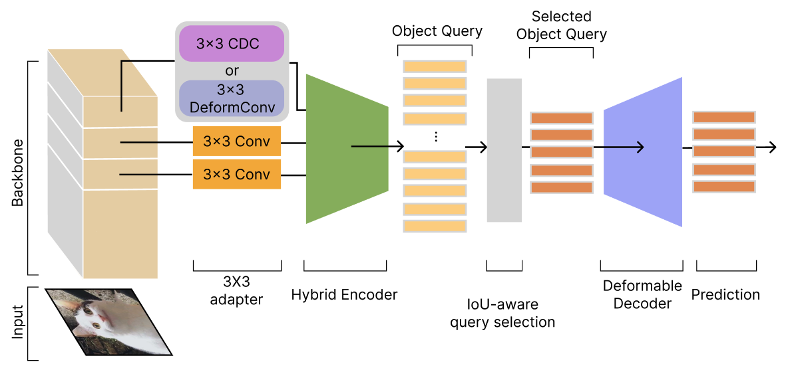

<h2 align="center">Transformer-based method with Deformable Convolution and Central Difference Convolution for Object Detection</h2>
<p align="center">
    <a href="https://github.com/leoliu5550/RT-DETRv2/blob/main/LICENSE">
        
    </a>
    <a href="httaaps://github.com/leoliu5550/RT-DETRv2/blob/main/LICENSE">
        
    </a>
    <a href="https://github.com/leoliu5550/RT-DETRv2/pulls">
        
    </a>
    <a href="https://github.com/leoliu5550/RT-DETRv2/issues">
        
    </a>
    <a href="https://github.com/leoliu5550/RT-DETRv2">
        
    </a>
    <!-- <a href="https://arxiv.org/abs/2304.08069">
        
    </a> -->
    <a href="mailto: leoliu5550@gmail.com">
        
    </a>
</p>

---
<details>
<summary>Fig</summary>


</details>


## Introduction

This study devotes to enhance the detection capabilities of real-time detection transformer (RT-DETR) by incorporating two adapter modules: the deformable convolutional network (DeformConv) and the central difference convolution (CDC) adapter module. These modules are integrated into backbone of RT-DETR and Transformer network, aiming to improve the ability of model to accurately locate and classify objects.

To evaluate the effectiveness of the proposed adapter modules, comprehensive experiments are conducted on two benchmark datasets: the NEU-DET steel plate crack dataset and the COCO dataset. On the NEU-DET dataset, compared to RT-DETR, the DeformConv adapter module achieved a significant 1\% improvement in mean average precision (mAP) for medium-sized defects and a 0.1\% improvement in recall (AR) for large-sized defects. These results highlight the capability of DeformConv for this type of defect with complex shapes. On the COCO dataset, the CDC adapter module exhibited a 0.1\% mAP gain and a 0.5\% AR improvement for medium-sized objects. These results demonstrate the effectiveness of CDC in extracting fine-grained details and distinguishing objects from the background. In summary, both DeformConv and CDC adapter modules have the potential to enhance the object detection capabilities of the RT-DETR model in different application scenarios. DeformConv can effectively capture object shape variations for complex-shaped object detection, while CDC can distinguish target objects from the background in situations where objects may be obscured or the background is complicated.

## Quick start

<details>
<summary>Install</summary>

```bash
pip install -r requirements.txt
```

</details>
<details>
<summary>Adapter</summary>

- For using central difference convolution at s5, replace `Adapter` with `CDCadapter`
- For using deformable convolution at s5, replace `Adapter` with `CDCadapter`
- For using RT-DETR, remain `Adapter`
- Modify config [`Adapter`, `CDCadapter`, `Deformadapter`](configs/rtdetr/include/rtdetr_r50vd.yml)
</details>


<details>
<summary>Data</summary>

- Download and extract COCO 2017 train and val images.
```
path/to/coco/
  annotations/  # annotation json files
  train2017/    # train images
  val2017/      # val images
```
- Modify config [`img_folder`, `ann_file`](configs/dataset/coco_detection.yml)
</details>


<details>
<summary>Training & Evaluation</summary>

- Training on a Single GPU:

```shell
# training on single-gpu
export CUDA_VISIBLE_DEVICES=0
python tools/train.py -c configs/rtdetr/rtdetr_r50vd_6x_coco.yml
```

- Training on Multiple GPUs:

```shell
# train on multi-gpu
export CUDA_VISIBLE_DEVICES=0,1,2,3
torchrun --nproc_per_node=4 tools/train.py -c configs/rtdetr/rtdetr_r50vd_6x_coco.yml
```

- Evaluation on Multiple GPUs:

```shell
# val on multi-gpu
export CUDA_VISIBLE_DEVICES=0,1,2,3
torchrun --nproc_per_node=4 tools/train.py -c configs/rtdetr/rtdetr_r50vd_6x_coco.yml -r path/to/checkpoint --test-only
```

</details>


<details>
<summary>Export</summary>

```shell
python tools/export_onnx.py -c configs/rtdetr/rtdetr_r18vd_6x_coco.yml -r path/to/checkpoint --check
```
</details>


